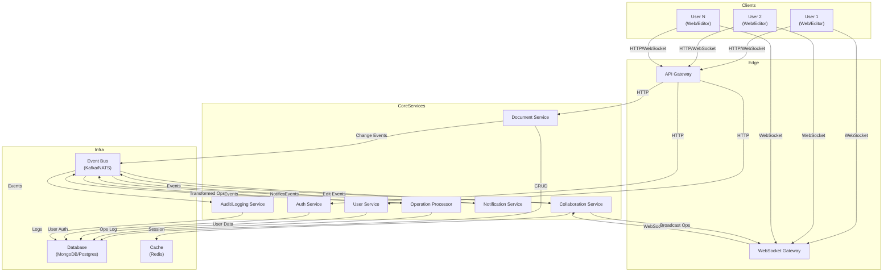

# Real-Time Collaborative Document Editing System Architecture

## 1. Core Requirements Breakdown

### Functional Requirements
- **Real-time Collaboration:** Multiple users can edit the same document at the same time, seeing each other's changes instantly.
- **Conflict Resolution:** The system must handle concurrent edits gracefully, ensuring a consistent document state.
- **Persistence & Versioning:** All changes are saved, with the ability to view or revert to previous versions.
- **Authentication & Permissions:** Only authorized users can access/edit documents, with possible roles (owner, editor, viewer).
- **Scalability:** Support for 1000+ concurrent users per document.

### Non-Functional Requirements
- **Low Latency:** Edits should propagate in near real-time (<200ms ideally).
- **Reliability:** No data loss, even in the event of failures.
- **Security:** Protect documents and user data.
- **Extensibility:** Easy to add features (comments, rich text, etc.).

---

## 2. Key Architectural Challenges & Decisions

### A. Real-Time Synchronization
- **Client-Server Communication:**
  - WebSockets (bi-directional, low-latency)
  - Server-Sent Events (SSE) or polling (less ideal)
- **Change Propagation:**
  - Broadcast changes to all connected clients editing the same document.

### B. Concurrency & Conflict Resolution
- **Merging Concurrent Edits:**
  - **Operational Transformation (OT):** Used by Google Docs; transforms operations to maintain consistency.
  - **Conflict-free Replicated Data Types (CRDTs):** Modern alternative, mathematically guarantees convergence.
- **Conflict Resolution Location:**
  - On the client, server, or both (usually both for efficiency and reliability).

### C. Document Persistence & Version History
- **Storage Model:**
  - Append-only log of operations (for replay/versioning)
  - Periodic snapshots for fast loading
  - Database choice: NoSQL (e.g., MongoDB, DynamoDB) for flexibility, or SQL for strong consistency.
- **Version Management:**
  - Store deltas/operations with timestamps and user IDs.

### D. User Authentication & Permissions
- **Authentication:**
  - OAuth, JWT, or session-based authentication.
- **Permissions:**
  - Role-based access control (RBAC) at the document level.

### E. Scalability & Performance
- **Handling High Concurrency:**
  - Horizontal scaling: Multiple server instances, load balancing.
  - Sharding documents across servers.
  - Efficient in-memory data structures for active documents.
- **Minimizing Latency:**
  - Edge servers, CDN for static assets, local caching.

### F. Fault Tolerance & Reliability
- **Data Durability:**
  - Durable writes (e.g., write-ahead logs)
  - Replication across data centers
- **Failure Recovery:**
  - Stateless servers with state stored in distributed cache (e.g., Redis) or database.

### G. Security Considerations
- **Data Protection:**
  - TLS for all communications
  - Encryption for stored documents
- **Access Control:**
  - Strict authentication and authorization checks

---

## 3. High-Level Component Overview

- **Client:** Rich text editor, handles local edits, communicates with server.
- **Collaboration Server:** Manages real-time connections, conflict resolution, broadcasting changes.
- **Persistence Layer:** Stores documents, operations, and version history.
- **Authentication Service:** Manages user login, tokens, and permissions.
- **API Gateway:** Entry point for RESTful operations (load, save, share, etc.).

---

## 4. Main Challenges

1. **Consistency vs. Latency:** Balancing instant feedback with eventual consistency.
2. **Efficient Conflict Resolution:** Choosing and implementing OT or CRDTs.
3. **Scalability:** Supporting thousands of users with minimal lag.
4. **Robust Persistence:** Ensuring no data loss and fast recovery.
5. **Security:** Protecting sensitive documents and user data.
6. **Extensibility:** Designing for future features (comments, media, plugins).

---

## 5. Key Architectural Decisions

- **Synchronization protocol:** WebSockets + OT/CRDT
- **Conflict resolution algorithm:** OT or CRDT (with pros/cons for each)
- **Data storage model:** Operation log + snapshots
- **Scalability approach:** Stateless servers, sharding, distributed cache
- **Authentication method:** JWT/OAuth
- **Permission model:** RBAC

---

## 6. Architectural Approaches

### 1. Traditional Server-Based Approach

**Core Components & Responsibilities**
- Monolithic Application Server: Handles all business logic, user sessions, document editing, and synchronization.
- Database: Stores documents, user data, version history.
- WebSocket/HTTP Layer: Manages client connections for real-time updates.
- Authentication Module: Manages user login and permissions.

**How Real-Time Synchronization Works**
- Clients connect to the server via WebSockets.
- All edits are sent to the server, which serializes and applies them to the document.
- The server broadcasts changes to all other connected clients.
- Conflict resolution is handled centrally (e.g., via locking or simple last-write-wins).

**Scalability Characteristics**
- Vertical scaling (scale up the server).
- Limited horizontal scaling; session stickiness or shared state required for multiple servers.
- Bottlenecked by single server's resources for high concurrency.

**Implementation Complexity**
- Low to Moderate: Easier to implement and reason about, especially for small teams or MVPs.
- Fewer moving parts, but complexity grows as features and user count increase.

**Trade-offs & Limitations**
- Pros: Simple, fast to build, easy to debug.
- Cons: Limited scalability, single point of failure, harder to maintain as the system grows.
- Real-time performance may degrade with many concurrent users.

---

### 2. Event-Driven Microservices Approach

**Core Components & Responsibilities**
- API Gateway: Routes requests to appropriate services.
- Auth Service: Handles authentication and authorization.
- Document Service: Manages document CRUD and versioning.
- Collaboration Service: Handles real-time editing sessions and synchronization.
- Event Bus (e.g., Kafka, RabbitMQ): Decouples services, propagates events (edits, user joins/leaves, etc.).
- WebSocket Gateway: Manages persistent client connections and forwards events.

**How Real-Time Synchronization Works**
- Clients connect to the WebSocket Gateway.
- Edits are published as events to the event bus.
- Collaboration Service consumes events, applies business logic, and emits updates.
- All interested clients receive updates via the WebSocket Gateway.
- Conflict resolution can be handled in the Collaboration Service, possibly using OT or CRDTs.

**Scalability Characteristics**
- High: Each service can be scaled independently.
- Event bus allows for horizontal scaling and decoupling.
- Can support thousands of concurrent users per document with proper partitioning.

**Implementation Complexity**
- High: Requires expertise in distributed systems, event-driven design, and service orchestration.
- More operational overhead (deployment, monitoring, inter-service communication).

**Trade-offs & Limitations**
- Pros: Highly scalable, resilient, flexible for future features.
- Cons: Increased complexity, potential for eventual consistency issues, debugging is harder.
- Requires robust monitoring and error handling.

---

### 3. Modern Real-Time Architecture with Operational Transformation (OT)

**Core Components & Responsibilities**
- Real-Time Collaboration Server: Specialized for handling OT algorithms, manages document state and user sessions.
- Document Storage: Stores base documents, operation logs, and snapshots.
- WebSocket Layer: Maintains persistent connections for low-latency updates.
- Auth & Permissions Service: Manages user access and roles.
- Client-Side OT Engine: Applies and transforms operations locally for instant feedback.

**How Real-Time Synchronization Works**
- Clients send operations (not raw text) to the server.
- The server applies OT to transform and merge concurrent operations, ensuring consistency.
- Transformed operations are broadcast to all clients, which apply them locally.
- Both server and clients maintain operation history for conflict resolution and undo/redo.

**Scalability Characteristics**
- Very High: Stateless collaboration servers can be scaled horizontally.
- Document state can be sharded by document ID.
- OT algorithms are efficient for high concurrency, as only operations are transmitted.

**Implementation Complexity**
- Very High: Requires deep understanding of OT algorithms and distributed consistency.
- Both server and client must implement compatible OT logic.
- More complex testing and debugging.

**Trade-offs & Limitations**
- Pros: Best-in-class real-time experience, strong consistency, efficient bandwidth usage.
- Cons: High implementation complexity, especially for rich text and complex document structures.
- Requires careful design to avoid edge-case bugs in OT logic.

---

### Summary Table

| Approach                        | Scalability | Complexity | Real-Time Quality | Trade-offs                        |
|----------------------------------|-------------|------------|-------------------|-----------------------------------|
| Traditional Server-Based         | Low-Med     | Low        | Good (small scale)| Simple, but not for large scale   |
| Event-Driven Microservices       | High        | High       | Very Good         | Flexible, but complex             |
| Modern Real-Time w/ OT           | Very High   | Very High  | Excellent         | Best UX, but hardest to build     |

---

## 7. Event-Driven Microservices Architecture: Detailed Design

### 1. Specific Services & Responsibilities

- **API Gateway**
  - Entry point for all HTTP/WebSocket traffic.
  - Routes requests to appropriate backend services.
  - Handles authentication tokens and rate limiting.

- **Auth Service**
  - Manages user registration, login, OAuth, JWT issuance, and validation.
  - Handles user roles and permissions.

- **User Service**
  - Manages user profiles, preferences, and metadata.

- **Document Service**
  - CRUD operations for documents.
  - Stores document metadata, access control lists, and version history.

- **Collaboration Service**
  - Manages real-time editing sessions.
  - Receives, processes, and broadcasts document edit events.
  - Handles user presence (who is editing/viewing).

- **Operation Processor Service**
  - Applies conflict resolution (e.g., OT/CRDT) to incoming operations.
  - Ensures document consistency and order of operations.

- **Notification Service**
  - Sends notifications (e.g., invites, comments, mentions) via email, push, or in-app.

- **Event Bus (e.g., Kafka, NATS, RabbitMQ)**
  - Decouples services.
  - Propagates events (edit, join, leave, save, etc.) between services.

- **WebSocket Gateway**
  - Maintains persistent client connections.
  - Forwards real-time events to/from clients and backend services.

- **Audit/Logging Service**
  - Tracks all changes and user actions for compliance and debugging.

---

### 2. Communication Patterns

- **Synchronous (HTTP/gRPC):**
  - API Gateway → Auth Service (login, token validation)
  - API Gateway → Document/User Service (CRUD, metadata)
- **Asynchronous (Event Bus):**
  - Collaboration Service ↔ Operation Processor Service (edit events)
  - Collaboration Service → Notification Service (user events)
  - Document Service → Audit Service (change logs)
- **Real-Time (WebSocket):**
  - Clients ↔ WebSocket Gateway ↔ Collaboration Service

---

### 3. Data Flow for Real-Time Collaboration

1. **User connects** via WebSocket to the WebSocket Gateway (after authentication).
2. **User joins a document session**; Collaboration Service registers presence.
3. **User makes an edit**; client sends operation to WebSocket Gateway.
4. **WebSocket Gateway** forwards the operation to the Collaboration Service.
5. **Collaboration Service** publishes the operation to the Event Bus.
6. **Operation Processor Service** consumes the event, applies conflict resolution (OT/CRDT), updates the canonical document state, and emits the transformed operation.
7. **Collaboration Service** receives the transformed operation and broadcasts it to all connected clients via the WebSocket Gateway.
8. **Document Service** persists the operation and updates version history.
9. **Audit Service** logs the operation for compliance.

---

### 4. Technology Stack Recommendations

- **API Gateway:** Kong, NGINX, or AWS API Gateway
- **Auth Service:** Node.js/Express, Go, or Python (FastAPI); JWT/OAuth2
- **User/Document Service:** Node.js, Go, Python, or Java (Spring Boot)
- **Collaboration/Operation Processor:** Node.js (socket.io), Go, or Elixir (Phoenix Channels)
- **WebSocket Gateway:** socket.io, ws (Node.js), or NATS WebSocket
- **Event Bus:** Apache Kafka, NATS, or RabbitMQ
- **Database:** 
  - **Document Store:** MongoDB, Couchbase, or PostgreSQL (JSONB)
  - **Event Store:** Kafka, EventStoreDB, or DynamoDB Streams
  - **Cache:** Redis or Memcached (for active sessions)
- **Deployment:** Kubernetes, Docker, Helm
- **Monitoring:** Prometheus, Grafana, ELK Stack

---

### 5. Database Design Considerations

- **Documents Table/Collection:**
  - `document_id` (PK)
  - `title`
  - `owner_id`
  - `collaborators` (list)
  - `created_at`, `updated_at`
  - `current_version`
- **Operations/Event Log:**
  - `operation_id` (PK)
  - `document_id` (FK)
  - `user_id`
  - `timestamp`
  - `operation_type` (insert, delete, etc.)
  - `operation_data` (serialized OT/CRDT op)
- **Version History:**
  - `version_id` (PK)
  - `document_id` (FK)
  - `snapshot_data`
  - `created_at`
- **User Table:**
  - `user_id` (PK)
  - `email`, `name`, `roles`, etc.

- **Indexes:** On `document_id`, `user_id`, and `timestamp` for fast lookups.

---

### 6. Conflict Resolution Strategy

- **Operational Transformation (OT) or CRDTs** in the Operation Processor Service.
- All incoming operations are transformed/merged to ensure consistency.
- The canonical document state is only updated after conflict resolution.
- Clients receive only transformed, conflict-free operations.

---

### 7. Scalability & Performance Optimizations

- **Stateless Services:** All services (except DB/cache) are stateless and horizontally scalable.
- **Sharding:** Documents and operations can be sharded by `document_id`.
- **Caching:** Use Redis for active document sessions and user presence.
- **Batching:** Batch operations for persistence to reduce DB writes.
- **Backpressure:** Apply backpressure on WebSocket Gateway to prevent overload.
- **Autoscaling:** Use Kubernetes HPA for dynamic scaling.
- **CDN:** Serve static assets via CDN for low latency.

---

### 8. Architectural Diagram (Text Format)

---

## 8. Implementation Plan

### 1. Development Phases and Priorities

**Phase 1: Foundation & Core Services**
- Set up version control, CI/CD, and basic project structure.
- Implement Auth Service (user registration, login, JWT/OAuth).
- Implement User Service (profile management).
- Implement Document Service (CRUD, metadata, versioning).
- Set up API Gateway and basic routing.

**Phase 2: Real-Time Collaboration Core**
- Implement WebSocket Gateway for persistent connections.
- Implement Collaboration Service (session management, presence).
- Implement Operation Processor Service (conflict resolution logic).
- Integrate Event Bus (Kafka/NATS/RabbitMQ) for inter-service communication.

**Phase 3: Persistence, Notifications, and Audit**
- Implement event logging and version history in Document Service.
- Implement Notification Service (in-app, email, etc.).
- Implement Audit/Logging Service.

**Phase 4: Advanced Features & Optimizations**
- Add caching (Redis) for active sessions and presence.
- Implement sharding and autoscaling.
- Add monitoring, alerting, and logging infrastructure.
- Optimize for performance and scalability.

**Phase 5: Testing, Hardening, and Deployment**
- Develop comprehensive test suites (unit, integration, E2E, real-time).
- Harden security (rate limiting, input validation, encryption).
- Prepare deployment scripts and infrastructure as code (IaC).

---

### 2. Service Implementation Order and Dependencies

1. **Auth Service** (prerequisite for all user actions)
2. **User Service** (depends on Auth)
3. **Document Service** (depends on Auth, User)
4. **API Gateway** (routes to Auth, User, Document)
5. **WebSocket Gateway** (depends on Auth for session validation)
6. **Collaboration Service** (depends on WebSocket Gateway, Document)
7. **Operation Processor Service** (depends on Collaboration, Event Bus)
8. **Event Bus** (integrates with Collaboration, Operation Processor, Notification, Audit)
9. **Notification Service** (depends on Event Bus)
10. **Audit/Logging Service** (depends on Event Bus)
11. **Cache/Redis** (used by Collaboration, Document, User)

---

### 3. API Contracts Between Services

**Auth Service**
- `POST /auth/register` – Register new user
- `POST /auth/login` – Authenticate user, return JWT
- `GET /auth/validate` – Validate JWT

**User Service**
- `GET /users/{id}` – Get user profile
- `PUT /users/{id}` – Update user profile

**Document Service**
- `POST /documents` – Create document
- `GET /documents/{id}` – Get document metadata/content
- `PUT /documents/{id}` – Update document
- `DELETE /documents/{id}` – Delete document
- `GET /documents/{id}/history` – Get version history

**Collaboration Service (WebSocket Events)**
- `join_document` – User joins a document session
- `leave_document` – User leaves session
- `edit_operation` – User submits an edit operation
- `presence_update` – User presence/typing status
- `broadcast_operation` – Server broadcasts transformed operation

**Operation Processor Service**
- Consumes `edit_operation` events from Event Bus
- Publishes `transformed_operation` events

**Notification Service**
- Consumes `notification_event` from Event Bus
- `POST /notifications` – Send notification

**Audit/Logging Service**
- Consumes all relevant events from Event Bus
- `POST /audit` – Log event

---

### 4. Database Schema Designs

**User Table**
| Field         | Type        | Notes           |
|---------------|-------------|-----------------|
| user_id (PK)  | UUID        |                 |
| email         | VARCHAR     | unique          |
| name          | VARCHAR     |                 |
| roles         | VARCHAR[]   |                 |
| created_at    | TIMESTAMP   |                 |

**Document Table**
| Field           | Type        | Notes           |
|-----------------|-------------|-----------------|
| document_id (PK)| UUID        |                 |
| title           | VARCHAR     |                 |
| owner_id        | UUID        | FK to user      |
| collaborators   | UUID[]      | FK to user      |
| created_at      | TIMESTAMP   |                 |
| updated_at      | TIMESTAMP   |                 |
| current_version | INT         |                 |

**Operation/Event Log**
| Field           | Type        | Notes           |
|-----------------|-------------|-----------------|
| operation_id(PK)| UUID        |                 |
| document_id     | UUID        | FK to document  |
| user_id         | UUID        | FK to user      |
| timestamp       | TIMESTAMP   |                 |
| operation_type  | VARCHAR     |                 |
| operation_data  | JSONB       | OT/CRDT payload |

**Version History**
| Field           | Type        | Notes           |
|-----------------|-------------|-----------------|
| version_id (PK) | UUID        |                 |
| document_id     | UUID        | FK to document  |
| snapshot_data   | JSONB       |                 |
| created_at      | TIMESTAMP   |                 |

**Notification Table**
| Field           | Type        | Notes           |
|-----------------|-------------|-----------------|
| notification_id | UUID        |                 |
| user_id         | UUID        | FK to user      |
| type            | VARCHAR     |                 |
| content         | TEXT        |                 |
| created_at      | TIMESTAMP   |                 |
| read            | BOOLEAN     |                 |

---

### 5. Technology Stack Setup Instructions

- **Monorepo or Polyrepo:** Choose based on team size and deployment needs.
- **Language Runtimes:** Install Node.js, Go, Python, or Java as needed.
- **API Gateway:** Deploy Kong/NGINX, configure routing and SSL.
- **Event Bus:** Deploy Kafka/NATS/RabbitMQ (prefer managed service for production).
- **Database:** Deploy MongoDB/PostgreSQL (with JSONB support), set up schemas.
- **Cache:** Deploy Redis, configure for session and presence caching.
- **WebSocket Gateway:** Use socket.io/ws (Node.js) or NATS WebSocket.
- **Containerization:** Use Docker for all services.
- **Orchestration:** Set up Kubernetes cluster, Helm charts for deployment.
- **CI/CD:** Set up GitHub Actions, GitLab CI, or Jenkins for automated builds, tests, and deployments.
- **Monitoring:** Deploy Prometheus, Grafana, and ELK stack for logs and metrics.

---

### 6. Testing Strategy for Real-Time Features

- **Unit Tests:** For all service logic, especially OT/CRDT algorithms.
- **Integration Tests:** Simulate multi-user editing sessions, verify consistency and conflict resolution.
- **End-to-End (E2E) Tests:** Use Cypress or Playwright to automate browser-based collaborative editing scenarios.
- **Load/Stress Tests:** Simulate 1000+ concurrent users per document using tools like Locust, Artillery, or k6.
- **Chaos Testing:** Introduce network partitions, service failures, and verify system resilience.
- **Security Testing:** Penetration tests, JWT validation, and permission checks.

---

### 7. Deployment and Infrastructure Considerations

- **Infrastructure as Code:** Use Terraform or Pulumi for cloud resource provisioning.
- **Kubernetes:** Use managed Kubernetes (EKS, GKE, AKS) for orchestration.
- **Service Discovery:** Use Kubernetes DNS or Consul.
- **Secrets Management:** Use Vault, AWS Secrets Manager, or Kubernetes Secrets.
- **Autoscaling:** Enable HPA for stateless services.
- **Blue/Green or Canary Deployments:** For zero-downtime releases.
- **Disaster Recovery:** Regular DB backups, multi-region replication for critical data.
- **Monitoring & Alerting:** Set up dashboards and alerts for latency, error rates, and resource usage.
- **CDN:** Use for static assets and edge caching.

---

### Actionable Steps for the Team

1. **Set up repositories, CI/CD, and base infrastructure.**
2. **Implement Auth, User, and Document services with basic API contracts.**
3. **Deploy API Gateway and Event Bus.**
4. **Develop and integrate WebSocket Gateway and Collaboration Service.**
5. **Implement Operation Processor with conflict resolution logic.**
6. **Build Notification and Audit services.**
7. **Design and migrate database schemas.**
8. **Write and automate tests for all layers, especially real-time flows.**
9. **Deploy to staging, run load and chaos tests, iterate on bottlenecks.**
10. **Prepare production deployment, monitoring, and disaster recovery plans.**
